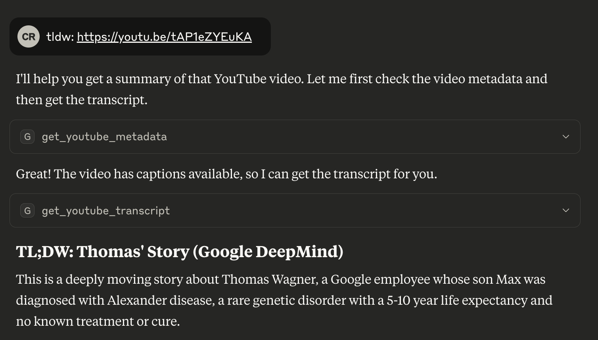
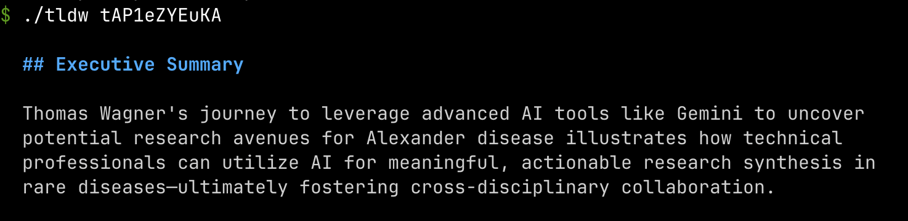

# tldw - too long; didn't watch

Transform YouTube videos into concise summaries using AI. Works with existing captions (free) or Whisper transcription (paid). Includes MCP server for Claude and other AI assistants and CLI.

## Installation

```bash
brew install rtzll/tap/tldw
export OPENAI_API_KEY="your-api-key-here"  # optional: for AI summaries & Whisper
```

## MCP

`tldw mcp` provides AI assistants with:
- **`get_youtube_metadata`**: Video info and captions status
- **`get_youtube_transcript`**: Free captions transcript
- **`transcribe_youtube_whisper`**: Paid Whisper transcription

### Claude Desktop Setup

**Easy setup:**
```bash
tldw mcp setup-claude
```

This automatically configures Claude Desktop to use tldw. Restart Claude Desktop afterward.

**After setup**, ask Claude: *"tldw: https://youtu.be/tAP1eZYEuKA"*



## ChatGPT Desktop (not yet)

ChatGPT Desktop will support MCP servers in the [coming months](https://x.com/OpenAIDevs/status/1904957755829481737).

## CLI

### Usage Examples

```bash
# Get transcript (free with captions)
tldw transcribe "https://youtu.be/tAP1eZYEuKA"
tldw transcribe tAP1eZYEuKA -o transcript.txt  # Save to file
tldw transcribe tAP1eZYEuKA --fallback-whisper # Use Whisper if video has no captions

# Generate summary (requires API key)
tldw "https://youtu.be/tAP1eZYEuKA"
tldw tAP1eZYEuKA -m o4-mini -p "tldr: {{.Transcript}}"

# Get video metadata
tldw metadata "https://youtu.be/tAP1eZYEuKA"
tldw metadata tAP1eZYEuKA -o metadata.json   # Save to file
tldw metadata tAP1eZYEuKA --pretty           # Format JSON output
```

### Example Output

Summaries are shown as markdown and rendered in the terminal.



## Configuration

Either edit the config file or use environment variables.

### Config file

**Find your config location:**
```bash
tldw paths  # Shows config, data, and cache directories
```

**Edit config file: `config.toml`**
```toml
openai_api_key = "your-key"
tldr_model = "gpt-4.1-nano"
prompt = "tldr: {{.Transcript}}"
```

or edit the `prompt.txt` file in the config directory to change the default summary prompt.

### Environment variables

```bash
export OPENAI_API_KEY="your-key"
export TLDW_TLDR_MODEL="gpt-4.1-nano"
export TLDW_PROMPT="tldr: {{.Transcript}}"
```
