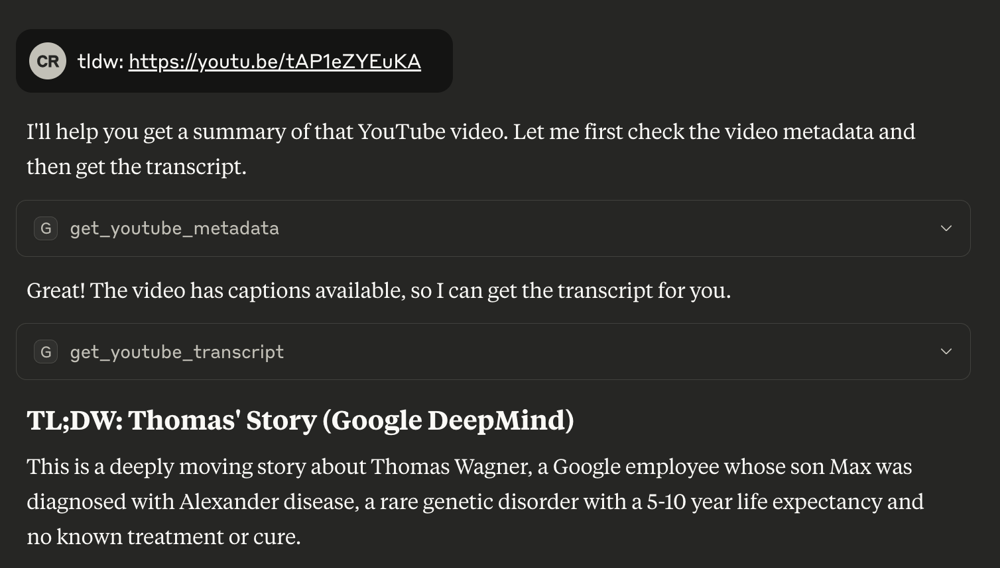
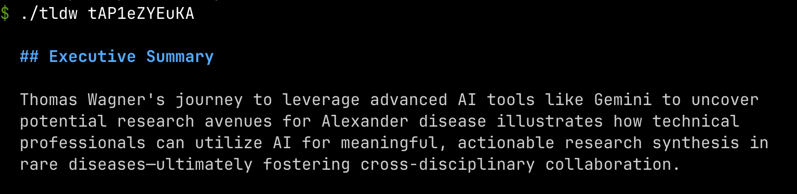

# tldw - too long; didn't watch

Transform YouTube videos and playlists into concise summaries using AI. Works
with existing captions (free) or Whisper transcription (paid). Includes MCP
server for Claude and other AI assistants and CLI.

## Installation

```bash
brew install rtzll/tap/tldw
export OPENAI_API_KEY="your-api-key-here"  # optional: for AI summaries & Whisper
```

## MCP

`tldw mcp` provides AI assistants with:

- **`get_youtube_metadata`**: Video metadata and captions status
- **`get_youtube_transcript`**: Free video captions transcript
- **`transcribe_youtube_whisper`**: Paid video Whisper transcription

`get_youtube_transcript` accepts `include_timestamps=true` to return caption
lines with timestamps when timing data is available.

### Claude Desktop Setup

**Easy setup:**

```bash
tldw mcp setup-claude
```

This automatically configures Claude Desktop to use tldw. Restart Claude Desktop
afterward.

**After setup**, ask Claude: _"tldw: https://youtu.be/tAP1eZYEuKA"_



### ChatGPT Setup

Use OpenAI Secure MCP Tunnel to connect ChatGPT to your local `tldw mcp` without
exposing a public server.

Download tunnel-client from
[Platform tunnel settings](https://platform.openai.com/settings/organization/tunnels).

```bash
mkdir -p bin
# Unzip the archive, then move the tunnel-client binary here:
mv /path/to/tunnel-client ./bin/tunnel-client
chmod +x ./bin/tunnel-client

export CONTROL_PLANE_API_KEY="sk-..."   # OpenAI runtime API key
export TLDW_TUNNEL_ID="tunnel_..."      # From Platform tunnel settings

just tunnel-init
just tunnel-doctor
just tunnel-run
```

The ChatGPT tunnel setup uses local HTTP MCP by default:

- `tldw mcp --transport=http` listens on `127.0.0.1:8765`
- `tunnel-client` keeps its own health/UI listener on `127.0.0.1:8080`

Override the MCP host or port with `TLDW_MCP_HTTP_HOST` or
`TLDW_MCP_HTTP_PORT` before `just tunnel-init`, or rerun `just tunnel-init`
after changing either value so the profile URL is updated.

Then open ChatGPT > Settings > Connectors > Create, choose **Tunnel**, and
select or paste the tunnel ID. Keep `just tunnel-run` running while using the
connector.

Optional: `just tunnel-launchd-install` stores the runtime key in Keychain and
starts both the local HTTP MCP server and the tunnel at login.

Tip: Put recurring summary prompts in a ChatGPT Project, then enable the `tldw`
connector in chats from that Project.

## CLI

### Usage Examples

#### Single Videos

```bash
# Get transcript (free with captions)
tldw transcribe "https://youtu.be/tAP1eZYEuKA"
tldw transcribe tAP1eZYEuKA -o transcript.txt  # Save to file
tldw transcribe tAP1eZYEuKA --timestamps       # Include caption timestamps
tldw transcribe tAP1eZYEuKA --fallback-whisper # Use Whisper if video has no captions

# Copy transcript to clipboard
tldw cp "https://youtu.be/tAP1eZYEuKA"
tldw cp tAP1eZYEuKA --fallback-whisper        # Whisper fallback supported

# Generate summary (requires API key)
tldw "https://youtu.be/tAP1eZYEuKA"
tldw tAP1eZYEuKA -m gpt-4o-mini -p "tldr: {{.Transcript}}"

# Get video metadata
tldw metadata "https://youtu.be/tAP1eZYEuKA"
tldw metadata tAP1eZYEuKA -o metadata.json   # Save to file
tldw metadata tAP1eZYEuKA --pretty           # Format JSON output
```

#### Playlists

```bash
# Summarize entire playlist
tldw "https://youtube.com/playlist?list=PLSE8ODhjZXjYDBpQnSymaectKjxCy6BYq"
tldw "https://youtu.be/tAP1eZYEuKA?list=PLSE8ODhjZXjYDBpQnSymaectKjxCy6BYq" # Video from playlist
```

**Note:** Playlist support is currently for summaries. Transcript and metadata
commands accept individual videos.

### Example Output

Summaries are shown as markdown and rendered in the terminal.



## Configuration

Either edit the config file or use environment variables.

### Config file

**Find your config location:**

```bash
tldw paths  # Shows config, data, and cache directories
```

**Edit config file: `config.toml`**

```toml
openai_api_key = "your-key"
tldr_model = "gpt-5.4-mini"
prompt = "tldr: {{.Transcript}}"
```

or edit the `prompt.txt` file in the config directory to change the default
summary prompt.

### Environment variables

```bash
export OPENAI_API_KEY="your-key"
export TLDW_TLDR_MODEL="gpt-5.4-mini"
export TLDW_PROMPT="tldr: {{.Transcript}}"
```
